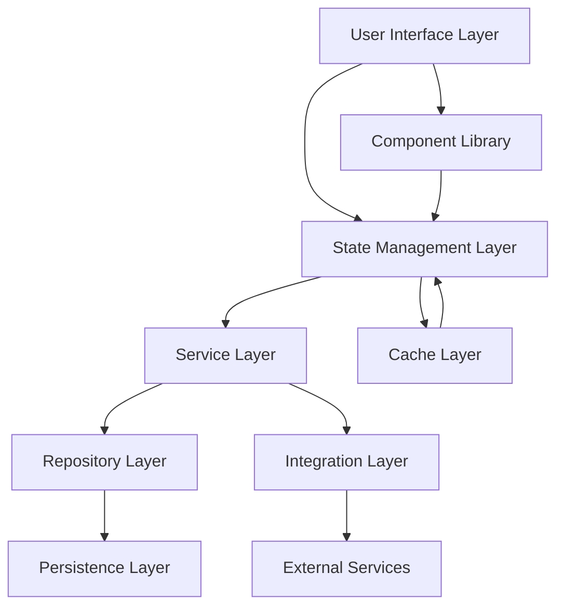
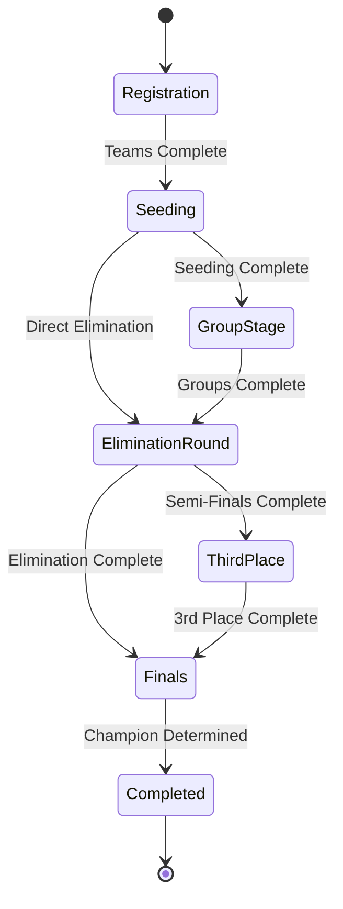
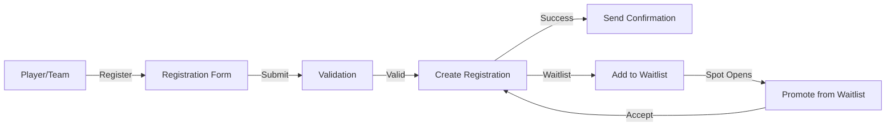
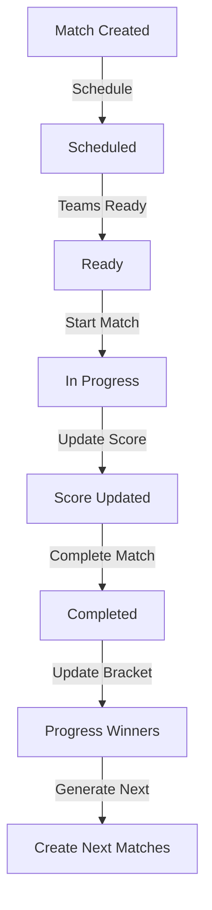

# CourtMaster Tournament Manager Architecture

## System Overview

CourtMaster is a tournament management system built with a modern web architecture, focusing on real-time updates, scalability, and user experience. The system supports multiple tournament formats, real-time scoring, and comprehensive tournament management features.

## High-Level Architecture



## Core Flows

### 1. Tournament Lifecycle Flow



### 2. Registration Flow



### 3. Match Progression Flow



## Layer Details

### 1. User Interface Layer
- React components for tournament management
- Real-time updates using WebSocket connections
- Responsive design for mobile and desktop
- Component library for consistent UI elements
- Progressive Web App (PWA) support
- Offline-first capabilities

### 2. State Management Layer (Zustand)
- Centralized state management
- Real-time state synchronization
- Optimistic updates for better UX
- Persistent state for offline capabilities
- Migration from Context API (70% complete)
- Type-safe store implementations

### 3. Service Layer
Key Services:
- **TournamentService**: Manages tournament lifecycle
- **RegistrationService**: Handles player/team registration
- **MatchService**: Controls match progression
- **BracketService**: Manages tournament brackets
- **NotificationService**: Handles system notifications
- **SchedulingService**: Manages court assignments
- **FormatService**: Handles tournament format logic
- **ValidationService**: Validates tournament rules

### 4. Repository Layer
- Abstract base repository pattern
- Type-safe database operations
- Optimistic concurrency control
- Cache management
- Error handling middleware
- Transaction support

### 5. Persistence Layer (Supabase)
- PostgreSQL database
- Real-time subscriptions
- Row-level security
- Built-in authentication
- Backup and recovery
- Data migration tools

## Key Features

### 1. Tournament Management
- Multiple tournament formats support
- Flexible bracket generation
- Real-time score updates
- Court scheduling
- Player/team management
- Tournament templates
- Custom scoring rules

### 2. Registration System
- Player/team registration
- Waitlist management
- Division assignments
- Category management
- Bulk registration support
- Registration deadlines
- Payment integration

### 3. Match Management
- Score tracking
- Match scheduling
- Court assignments
- Official assignments
- Match history
- Score validation
- Match statistics

### 4. Bracket System
- Single elimination
- Double elimination
- Round robin
- Swiss system
- Group stage + knockout
- Multi-stage formats
- Custom formats
- Seeding support

## Data Models

### Core Entities
```typescript
Tournament {
  id: string
  name: string
  format: TournamentFormat
  status: TournamentStatus
  stages: TournamentStage[]
  divisions: Division[]
  categories: Category[]
  metadata: TournamentMetadata
  scoring: ScoringSettings
}

Registration {
  id: string
  tournamentId: string
  playerId: string
  status: RegistrationStatus
  metadata: RegistrationMetadata
  category: Category
  division: Division
}

Match {
  id: string
  tournamentId: string
  stage: TournamentStage
  teams: [Team, Team]
  scores: Score[]
  status: MatchStatus
  progression: MatchProgression
  courtAssignment: CourtAssignment
  scheduledTime: Date
}
```

## State Management

### Zustand Stores
- **tournamentStore**: Tournament state and operations
- **registrationStore**: Registration management
- **matchStore**: Match state and scoring
- **bracketStore**: Bracket progression
- **uiStore**: UI state management
- **notificationStore**: System notifications
- **userStore**: User preferences and settings

## Security Model

### Authentication
- JWT-based authentication
- Role-based access control
- Session management
- OAuth integration
- Two-factor authentication support

### Authorization
- Tournament-level permissions
- Match-level access control
- Administrative functions protection
- API rate limiting
- Resource-based permissions

## Integration Points

### External Services
- Email service for notifications
- Payment processing
- Document generation
- Analytics integration
- Social media sharing
- Calendar integration

## Development Guidelines

### Code Organization
- Feature-based directory structure
- Shared utilities and hooks
- Common types and interfaces
- Reusable components
- Testing utilities
- Documentation standards

## Deployment Architecture

### Infrastructure
- Vercel for frontend hosting
- Supabase for backend services
- CloudFlare for CDN
- GitHub Actions for CI/CD
- Docker for local development

### Environments
- Development
- Staging
- Production
- QA/Testing

## Performance Considerations

### Optimizations
- Code splitting
- Lazy loading
- Image optimization
- Cache strategies
- Database indexing
- Real-time updates batching

### Scalability
- Horizontal scaling
- Load balancing
- Connection pooling
- Rate limiting
- Resource optimization

## Monitoring and Analytics

### Key Metrics
- User engagement
- System performance
- Error rates
- API response times
- Real-time connections
- Database performance

### Logging
- Application logs
- Error tracking
- User actions
- Performance metrics
- Security events
- Audit trail

### Analytics
- User behavior
- Tournament statistics
- Match analytics
- System usage
- Performance trends
- Feature adoption 