# CourtMaster Tournament Management System: Comprehensive Architecture

## Table of Contents

1. [Introduction](#introduction)
2. [System Overview](#system-overview)
3. [Frontend Architecture](#frontend-architecture)
4. [Backend Integration](#backend-integration)
5. [Data Layer](#data-layer)
6. [Event-Driven Architecture](#event-driven-architecture)
7. [Offline Synchronization](#offline-synchronization)
8. [Sport Integration Framework](#sport-integration-framework)
9. [Scheduling System](#scheduling-system)
10. [Security Architecture](#security-architecture)
11. [Deployment Architecture](#deployment-architecture)
12. [Performance Optimizations](#performance-optimizations)
13. [Future Considerations](#future-considerations)

## Introduction

This document provides a comprehensive overview of the CourtMaster Tournament Management System architecture. It outlines the technical design, component relationships, data flow patterns, and implementation details necessary for understanding and extending the system.

CourtMaster Tournament Management System is a versatile platform designed for organizing, managing, and scoring tournaments across multiple sports. Initially focused on badminton, the system now supports tennis, volleyball, and other court-based sports with an extensible architecture to add more sports as needed.

The architecture follows modern design principles, emphasizing:
- **Modularity**: Independent components with clear responsibilities
- **Extensibility**: Flexible interfaces for adding new sports and features
- **Reliability**: Robust error handling and offline capabilities
- **Performance**: Optimized data structures and rendering

## System Overview

The CourtMaster Tournament Management System is built using a modern React architecture with Appwrite as the backend service. The system follows a layered architecture pattern with clear separation of concerns between UI components, business logic, and data access.

### High-Level System Architecture

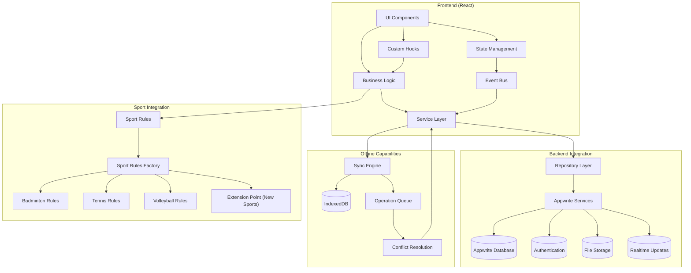

### Key System Components

1. **Frontend Layer**:
   - React components for UI rendering
   - Custom hooks for encapsulated business logic
   - React Context for global state management
   - Event Bus for decoupled component communication

2. **Service Layer**:
   - Business logic implementation
   - Tournament operations and scoring rules
   - Data validation and processing

3. **Repository Layer**:
   - Abstraction over data access
   - CRUD operations for entities
   - Caching and optimization

4. **Backend Integration**:
   - Appwrite services for authentication, database, storage
   - Real-time updates via WebSockets

5. **Offline Capabilities**:
   - IndexedDB for local data persistence
   - Operation queuing for offline actions
   - Synchronization with conflict resolution

6. **Sport Integration Framework**:
   - Pluggable sport rules implementations
   - Factory pattern for sport-specific functionality
   - Extensible interfaces for adding new sports

## Frontend Architecture

The CourtMaster frontend is built with React using a component-based architecture. It employs modern React patterns including hooks, contexts, and a clear separation between presentational and container components.

### Component Hierarchy

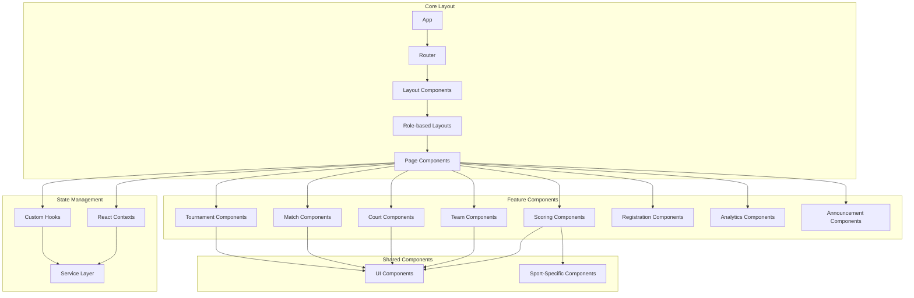

### Component Types

1. **Core Components**:
   - `App`: The root component that initializes the application
   - `Router`: Handles application routing using React Router
   - `Layout`: Provides consistent page structure and navigation
   - `RoleBasedLayouts`: Different layouts based on user roles (organizer, scorer, etc.)

2. **Feature Components**:
   - `TournamentComponents`: Tournament creation, management, and display
   - `MatchComponents`: Match creation, scheduling, and display
   - `CourtComponents`: Court management and visualization
   - `ScoringComponents`: Real-time score entry and display
   - `RegistrationComponents`: Team and player registration
   - `AnalyticsComponents`: Tournament statistics and reports
   - `AnnouncementComponents`: Tournament announcements and notifications

3. **Shared Components**:
   - `UI Components`: Buttons, forms, modals, and other reusable UI elements
   - `Sport-Specific Components`: Components tailored for different sports

### Directory Structure

The component directory structure follows a feature-based organization:

```
src/
├── components/
│   ├── admin/
│   ├── analytics/
│   ├── announcement/
│   ├── auth/
│   ├── check-in/
│   ├── court/
│   ├── dashboard/
│   ├── landing/
│   ├── layout/
│   ├── match/
│   ├── notification/
│   ├── profile/
│   ├── public/
│   ├── registration/
│   ├── scoring/
│   ├── settings/
│   ├── shared/
│   ├── team/
│   ├── tournament/
│   └── ui/
├── contexts/
│   ├── auth/
│   ├── notification/
│   └── registration/
├── hooks/
├── services/
└── utils/
```

### State Management

The application uses a combination of state management approaches:

1. **React Context API**: For global state shared across many components
   - AuthContext: User authentication state
   - TournamentContext: Active tournament data
   - NotificationContext: System notifications

2. **Custom Hooks**: For encapsulated business logic
   - `useScoringLogic`: Sport-specific scoring operations
   - `useTournament`: Tournament operations
   - `useOfflineSync`: Offline data synchronization
   - `useSchedule`: Schedule management

3. **Local Component State**: For component-specific UI state
   - Form values and validation
   - UI toggle states
   - Local UI interactions

## Backend Integration

CourtMaster integrates with Appwrite as its backend-as-a-service (BaaS) solution. This provides authentication, database, storage, and real-time functionality without requiring a custom server implementation.

### Data Flow Architecture

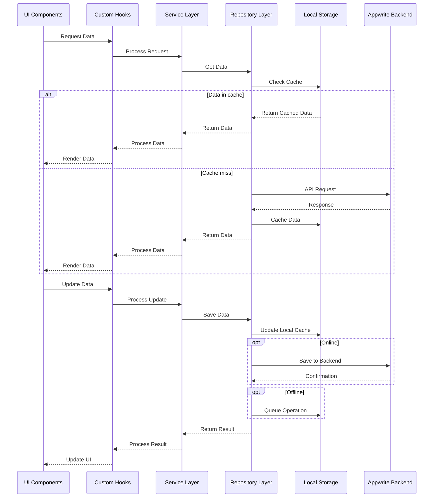

### Appwrite Integration Components

1. **Authentication Services**:
   - User registration and login
   - Session management
   - Role-based access control
   - OAuth integration

2. **Database Services**:
   - Document storage and retrieval
   - Collection management
   - Query operations
   - Real-time data subscriptions

3. **Storage Services**:
   - File uploads (player photos, tournament logos)
   - Asset management
   - Image optimization

4. **Real-time Services**:
   - WebSocket connections
   - Real-time data updates
   - Event subscriptions

### Repository Pattern Implementation

The Repository pattern abstracts the data access layer, providing a clean API for the service layer and isolating the application from direct Appwrite dependencies:

```typescript
// Generic repository interface
interface Repository<T> {
  findAll(): Promise<T[]>;
  findById(id: string): Promise<T | null>;
  findByQuery(query: any): Promise<T[]>;
  create(data: Omit<T, 'id'>): Promise<T>;
  update(id: string, data: Partial<T>): Promise<T>;
  delete(id: string): Promise<void>;
}

// Appwrite implementation
class AppwriteRepository<T> implements Repository<T> {
  constructor(
    private database: Databases,
    private collectionId: string,
    private databaseId: string
  ) {}

  async findAll(): Promise<T[]> {
    const response = await this.database.listDocuments(
      this.databaseId,
      this.collectionId
    );
    return response.documents as unknown as T[];
  }

  async findById(id: string): Promise<T | null> {
    try {
      const response = await this.database.getDocument(
        this.databaseId,
        this.collectionId,
        id
      );
      return response as unknown as T;
    } catch (error) {
      if (error instanceof AppwriteException && error.code === 404) {
        return null;
      }
      throw error;
    }
  }

  // Other methods implementation...
}
```

## Data Layer

The data layer of CourtMaster consists of well-defined domain models, repository interfaces, and data access implementations. This layer ensures type safety, consistency, and separation of concerns between business logic and data access.

### Domain Model Architecture

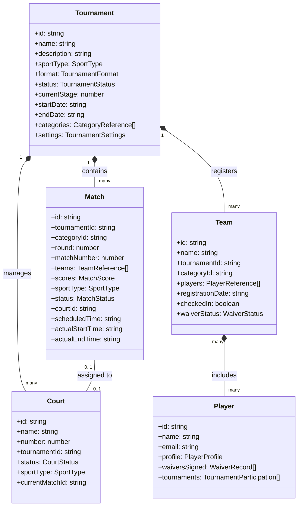

### Database Collections and Relationships

The data model is mapped to Appwrite collections as follows:

| Collection | Description | Key Relationships | Indexes |
|------------|-------------|-------------------|----------|
| tournaments | Tournament records | One-to-many with matches, courts, teams | status, createdBy, startDate |
| matches | Match records | Many-to-one with tournaments, courts | tournamentId + status, courtId + scheduledTime |
| teams | Team records | Many-to-one with tournaments | tournamentId + categoryId |
| courts | Court records | Many-to-one with tournaments | tournamentId + status |
| players | Player records | Many-to-many with teams | email (unique), tournamentId + waiverSigned |
| notifications | System notifications | Many-to-one with users | userId + read, createdAt |
| announcements | Tournament announcements | Many-to-one with tournaments | tournamentId + isActive, displayStart |

### Data Validation Strategy

Data validation occurs at multiple layers:

1. **UI Layer**: Form validation using React Hook Form and Zod schemas
2. **Service Layer**: Business rules validation before data persistence
3. **Repository Layer**: Schema validation before API calls
4. **Backend**: Appwrite permission rules and database constraints

Example validation schema:

```typescript
const tournamentSchema = z.object({
  name: z.string().min(3).max(100),
  sportType: z.enum(SportTypes),
  format: z.enum(TournamentFormats),
  startDate: z.string().datetime(),
  endDate: z.string().datetime().optional(),
  categories: z.array(categoryReferenceSchema).min(1),
  // Other fields
});
```

## Event-Driven Architecture

CourtMaster uses an event-driven architecture to enable decoupled communication between components, facilitating real-time updates and asynchronous operations.

### Event Bus System

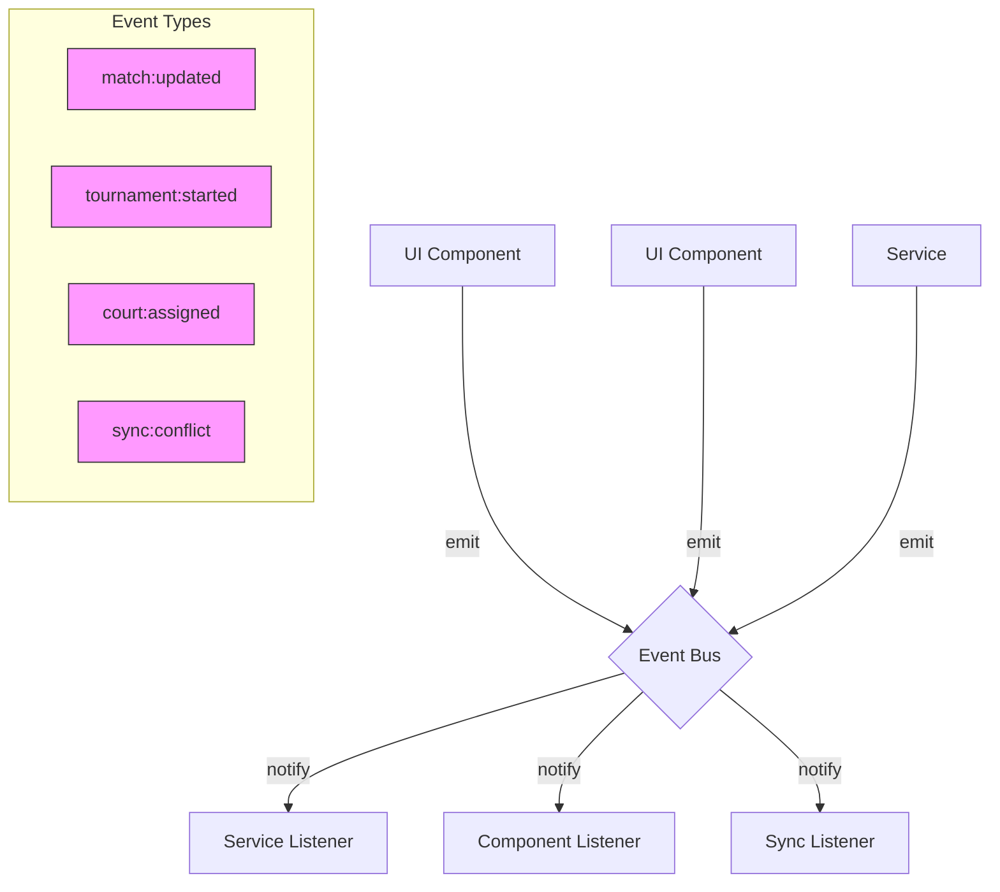

### Event Flow Process

1. **Event Emission**: Components or services emit events with typed payloads
2. **Event Routing**: The event bus routes events to registered listeners
3. **Event Handling**: Listeners process events and trigger appropriate actions
4. **State Updates**: UI components re-render based on state changes

### Event Bus Implementation

```typescript
interface EventMap {
  'match:updated': { matchId: string; score: MatchScore };
  'match:completed': { matchId: string; winnerId: string };
  'tournament:started': { tournamentId: string };
  'court:assigned': { courtId: string; matchId: string };
  'team:registered': { teamId: string; tournamentId: string };
  'sync:conflict_detected': { entityType: string; entityId: string; conflictType: string };
  // Other events
}

interface EventBus {
  emit<T extends keyof EventMap>(event: T, payload: EventMap[T]): void;
  on<T extends keyof EventMap>(event: T, handler: (payload: EventMap[T]) => void): () => void;
  off<T extends keyof EventMap>(event: T, handler: (payload: EventMap[T]) => void): void;
}

class EventBusImpl implements EventBus {
  private listeners: Map<keyof EventMap, Set<Function>> = new Map();

  emit<T extends keyof EventMap>(event: T, payload: EventMap[T]): void {
    const handlers = this.listeners.get(event);
    if (handlers) {
      handlers.forEach(handler => handler(payload));
    }
  }

  on<T extends keyof EventMap>(event: T, handler: (payload: EventMap[T]) => void): () => void {
    if (!this.listeners.has(event)) {
      this.listeners.set(event, new Set());
    }
    this.listeners.get(event)?.add(handler);
    
    // Return unsubscribe function
    return () => this.off(event, handler);
  }

  off<T extends keyof EventMap>(event: T, handler: (payload: EventMap[T]) => void): void {
    const handlers = this.listeners.get(event);
    if (handlers) {
      handlers.delete(handler);
    }
  }
}

// Singleton instance
export const eventBus = new EventBusImpl();
```

## Offline Synchronization

CourtMaster features a sophisticated offline synchronization system that enables tournament operations to continue during network disruptions. This system uses a combination of local storage, operation queuing, and conflict resolution to ensure data integrity.

### Offline Sync Architecture

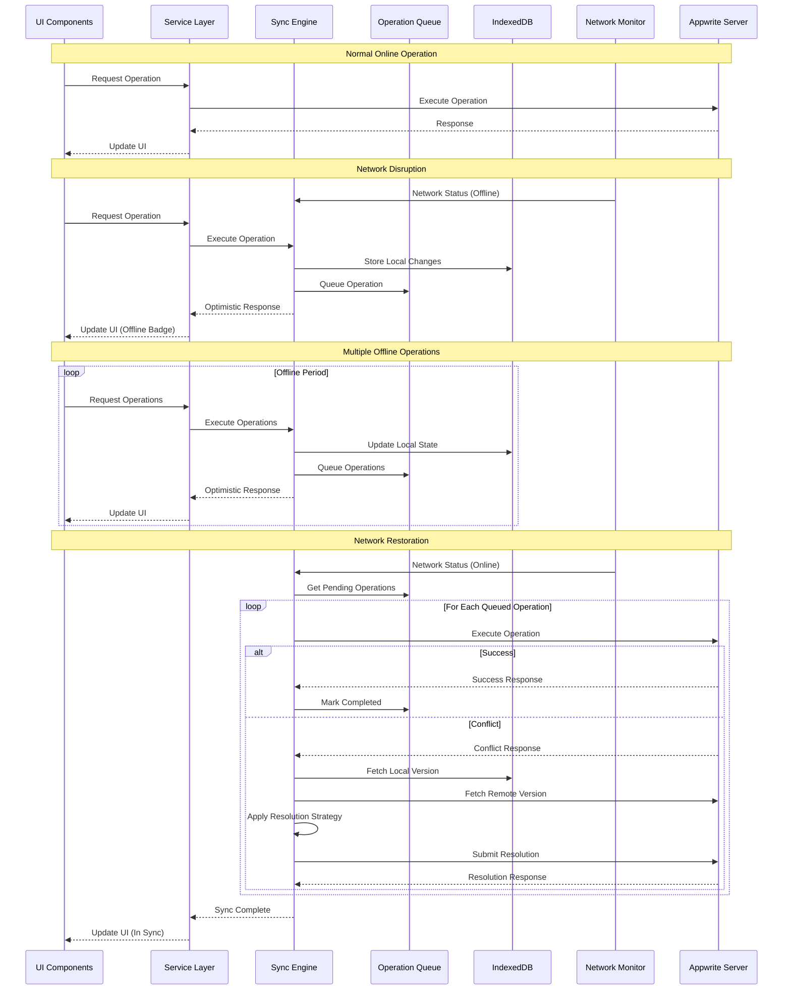

### Operation Queue Management

The operation queue manages operations that need to be synchronized with the server when connectivity is restored:

1. **Operation Structure**:
   ```typescript
   interface Operation {
     id: string;
     type: OperationType; // CREATE, UPDATE, DELETE, etc.
     entityType: string; // 'tournament', 'match', etc.
     entityId: string;
     data: any; // Operation payload
     timestamp: string; // ISO 8601 UTC
     version: number; // Expected entity version
     dependencies: string[]; // Operation IDs this depends on
     retryCount: number;
     status: OperationStatus; // PENDING, IN_PROGRESS, COMPLETED, FAILED, CONFLICT
   }
   ```

2. **Queueing Process**:
   - Operations are queued when offline
   - Dependency relationships are maintained
   - Optimistic UI updates show pending changes

3. **Synchronization Process**:
   - Operations processed in dependency order
   - Batch processing for efficiency
   - Retry mechanism for failed operations

### Conflict Resolution

The conflict resolution system handles cases where local changes conflict with server-side changes:

1. **Detection Strategies**:
   - Version mismatch detection
   - Field-level change detection
   - Timestamp-based detection

2. **Resolution Strategies**:
   - `LOCAL_WINS`: Local changes override server changes
   - `REMOTE_WINS`: Server changes override local changes
   - `LATEST_TIMESTAMP`: Most recent changes prevail
   - `MERGE`: Combine non-conflicting changes
   - `MANUAL`: Prompt user for resolution

3. **Implementation**:
   ```typescript
   class ConflictResolver {
     async resolveConflict(conflict: Conflict, strategy: ConflictStrategy): Promise<ConflictResolution> {
       switch (strategy) {
         case ConflictStrategy.LOCAL_WINS:
           return this.resolveWithLocalWins(conflict);
         case ConflictStrategy.REMOTE_WINS:
           return this.resolveWithRemoteWins(conflict);
         case ConflictStrategy.LATEST_TIMESTAMP:
           return this.resolveWithLatestTimestamp(conflict);
         case ConflictStrategy.MERGE:
           return this.resolveWithMerge(conflict);
         case ConflictStrategy.MANUAL:
           return this.requestManualResolution(conflict);
         default:
           throw new Error(`Unknown conflict strategy: ${strategy}`);
       }
     }
     
     // Strategy-specific implementations...
   }
   ```

### Deterministic Merge Rules

For complex data structures, the system uses entity-specific merge rules:

| Entity Type | Field | Strategy | Description |
|------------|-------|----------|-------------|
| match | scores | LATEST_TIMESTAMP | Use most recent score updates |
| team | players | ARRAY_UNION | Combine player lists from both versions |
| tournament | status | VALID_TRANSITION | Only allow valid state transitions |
| court | status | PRIORITY_BASED | Higher priority status wins |

This ensures consistent behavior across all clients when resolving conflicts.

## Sport Integration Framework

One of CourtMaster's key features is its ability to support multiple sports with their unique rules and scoring systems. This is achieved through a flexible Sport Integration Framework that allows for adding new sports without modifying core application logic.

### Sport Rules Architecture

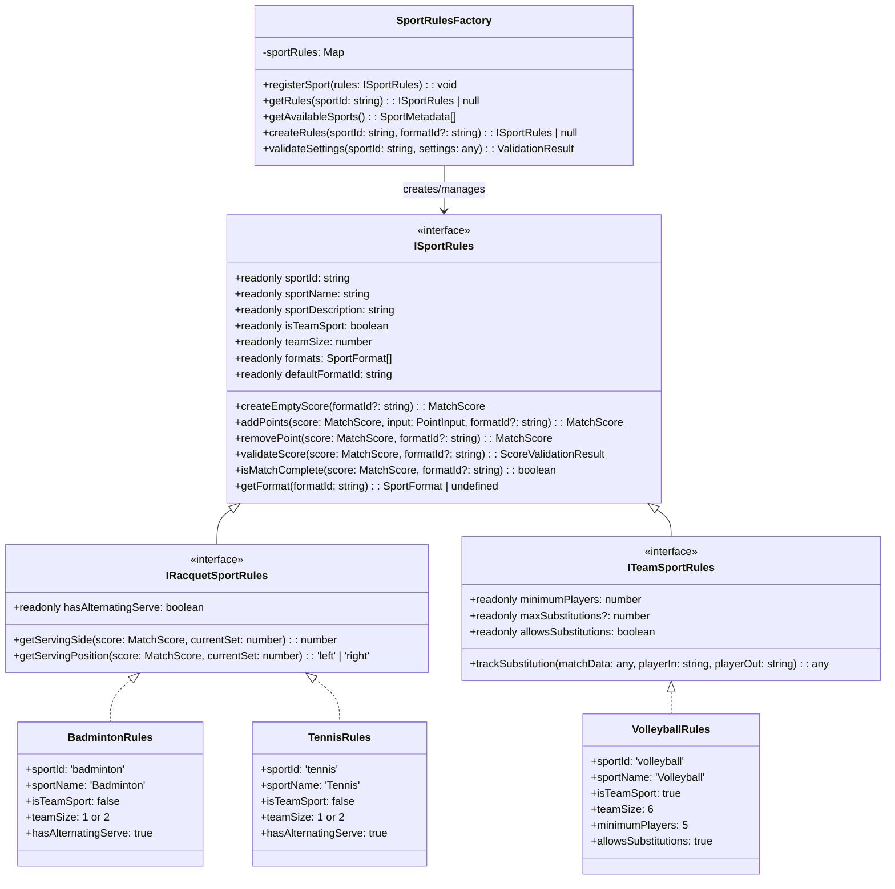

### Factory Pattern Implementation

The Sport Rules Factory provides a central point for creating and managing sport-specific rule implementations:

```typescript
class SportRulesFactory {
  private sportRules: Map<string, ISportRules> = new Map();
  
  constructor() {
    // Register available sport implementations
    this.registerSport(BadmintonRules);
    this.registerSport(TennisRules);
    this.registerSport(VolleyballRules);
  }
  
  private registerSport(rules: ISportRules): void {
    this.sportRules.set(rules.sportId, rules);
  }
  
  getRules(sportId: string): ISportRules | null {
    return this.sportRules.get(sportId) || null;
  }
  
  createRules(sportId: string, formatId?: string): ISportRules | null {
    const rules = this.getRules(sportId);
    
    if (!rules) {
      return null;
    }
    
    // If a format ID is provided, validate it
    if (formatId && !rules.getFormat(formatId)) {
      return null;
    }
    
    return rules;
  }
}
```

### Integration Flow

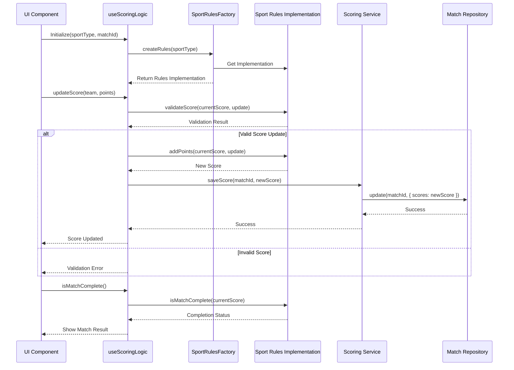

### Extension Process

To add support for a new sport, the following steps are required:

1. **Create Sport Rules Implementation**:
   - Identify appropriate interface (IRacquetSportRules, ITeamSportRules, etc.)
   - Implement required methods and properties
   - Define sport-specific formats and settings

2. **Register with Factory**:
   - Add the new implementation to the SportRulesFactory constructor

3. **Add UI Components** (if needed):
   - Create sport-specific scoring components
   - Implement unique visualization elements

4. **Configure Templates** (optional):
   - Add tournament templates specific to the new sport

This extensible architecture allows CourtMaster to grow and support new sports with minimal changes to the core codebase.

## Scheduling System

The scheduling system in CourtMaster is a sophisticated component designed to efficiently manage court assignments, match scheduling, and tournament timelines. It uses advanced algorithms to optimize the use of available resources while respecting constraints and preferences.

### Scheduling Architecture

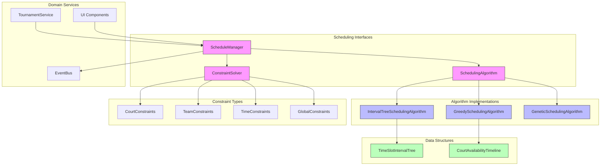

### Optimized Data Structures

The scheduling system uses specialized data structures for performance optimization:

1. **Interval Tree**: For efficient time slot queries
   ```typescript
   class TimeSlotIntervalTree {
     private root: IntervalNode | null = null;
   
     // O(log n) insertion
     insert(slot: TimeSlot): void {
       this.root = this.insertNode(this.root, slot);
     }
   
     // O(log n + k) where k is number of overlapping intervals
     findOverlapping(query: TimeSlot): TimeSlot[] {
       const result: TimeSlot[] = [];
       this.searchOverlapping(this.root, query, result);
       return result;
     }
   
     // O(log n) search for available slots
     findAvailableSlot(duration: number, after: Date): TimeSlot | null {
       return this.searchAvailable(this.root, duration, after);
     }
   }
   ```

2. **Court Availability Timeline**: For tracking court usage
   ```typescript
   class CourtAvailabilityTimeline {
     private events: TimelineEvent[] = [];
   
     // O(log n) to find next available slot
     findNextAvailableSlot(
       startTime: Date,
       duration: number,
       courtRequirements?: CourtRequirement[]
     ): AvailableSlot | null {
       // Implementation details
     }
   
     // O(log n) to reserve a time slot
     reserveSlot(courtId: string, slot: TimeSlot, matchId: string): void {
       // Implementation details
     }
   }
   ```

### Scheduling Algorithm Selection

CourtMaster provides multiple scheduling algorithms to accommodate different tournament sizes and requirements:

| Algorithm | Time Complexity | Best For | Optimization Focus |
|-----------|----------------|----------|--------------------|
| Greedy | O(n log n) | Small-medium tournaments | Speed, simplicity |
| Interval Tree | O(n log n + k log n) | Large tournaments | Efficient resource utilization |
| Genetic | O(g * p * n) | Complex constraints | Solution quality |

Where:
- n = number of matches
- k = number of scheduling attempts
- g = number of generations (genetic algorithm)
- p = population size (genetic algorithm)

### Scheduling Workflow

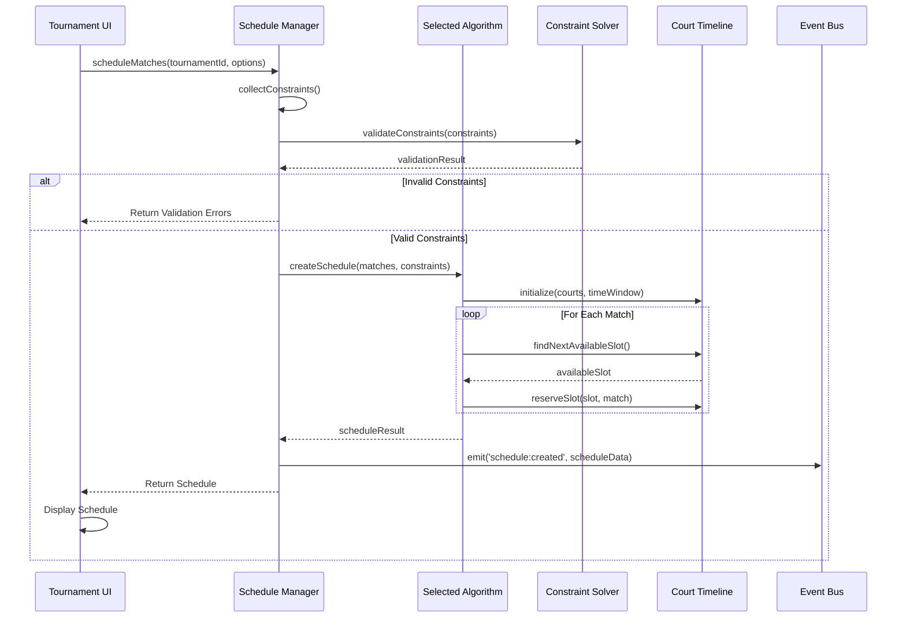

### Constraint System

The scheduling system enforces various constraints to ensure valid schedules:

1. **Court Constraints**:
   - Availability windows
   - Sport compatibility
   - Court features required by matches

2. **Team Constraints**:
   - Minimum rest periods between matches
   - Maximum matches per time window
   - Concurrent match restrictions

3. **Time Constraints**:
   - Tournament operating hours
   - Blocked time periods
   - Priority time slots

4. **Global Constraints**:
   - Match duration by category/sport
   - Tournament format requirements
   - Round progression rules

## Security Architecture

Security is a critical aspect of the CourtMaster Tournament Management System, protecting user data, tournament information, and system integrity through multiple layers of defense.

### Authentication and Authorization

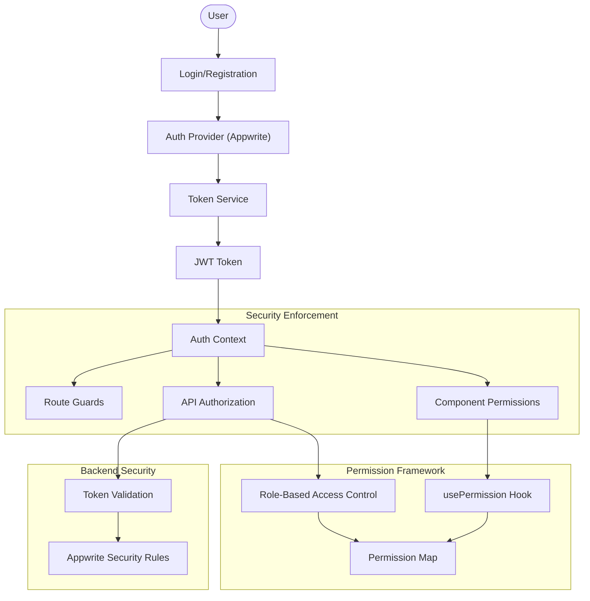

### Authentication Flow

1. **User Authentication**:
   - User provides credentials (email/password or OAuth)
   - Credentials validated against Appwrite Auth
   - JWT tokens issued and stored securely
   - Tokens automatically refreshed before expiration

2. **Token Management**:
   - Access tokens stored in memory (not localStorage)
   - Refresh tokens stored in httpOnly cookies
   - Token rotation with each refresh
   - Token invalidation on logout

3. **Session Security**:
   - Inactive session timeout
   - Device fingerprinting
   - Concurrent session detection
   - Suspicious activity monitoring

### Authorization System

CourtMaster implements a role-based access control (RBAC) system with fine-grained permissions:

```typescript
enum UserRole {
  ADMIN = 'admin',
  ORGANIZER = 'organizer',
  SCORER = 'scorer',
  FRONT_DESK = 'front_desk',
  ANNOUNCER = 'announcer',
  PARTICIPANT = 'participant',
  VIEWER = 'viewer'
}

enum Permission {
  // Tournament permissions
  CREATE_TOURNAMENT = 'tournament:create',
  UPDATE_TOURNAMENT = 'tournament:update',
  DELETE_TOURNAMENT = 'tournament:delete',
  VIEW_TOURNAMENT = 'tournament:view',
  
  // Match permissions
  CREATE_MATCH = 'match:create',
  UPDATE_MATCH = 'match:update',
  DELETE_MATCH = 'match:delete',
  VIEW_MATCH = 'match:view',
  UPDATE_SCORE = 'match:update_score',
  
  // Team permissions
  MANAGE_TEAMS = 'team:manage',
  VIEW_TEAMS = 'team:view',
  
  // Other permissions
  MANAGE_COURTS = 'court:manage',
  CREATE_ANNOUNCEMENTS = 'announcement:create',
  MANAGE_CHECK_IN = 'check_in:manage'
}

const rolePermissionMap: Record<UserRole, Permission[]> = {
  [UserRole.ADMIN]: [
    // All permissions
  ],
  [UserRole.ORGANIZER]: [
    Permission.CREATE_TOURNAMENT,
    Permission.UPDATE_TOURNAMENT,
    Permission.VIEW_TOURNAMENT,
    // More permissions...
  ],
  [UserRole.SCORER]: [
    Permission.VIEW_TOURNAMENT,
    Permission.VIEW_MATCH,
    Permission.UPDATE_SCORE,
    // More permissions...
  ],
  // Other roles and their permissions
};
```

### Security Implementation

1. **Frontend Security**:
   - Route guards prevent unauthorized access to protected routes
   - UI components conditionally render based on permissions
   - Form validation and input sanitization
   - Content Security Policy (CSP) implementation

2. **API Security**:
   - JWT validation for all API requests
   - Request rate limiting
   - API endpoint permission checks
   - Input validation and sanitization

3. **Data Security**:
   - Appwrite collection security rules
   - Field-level access control
   - Data encryption at rest
   - Data masking for sensitive information

### Permission Enforcement

Permissions are enforced at multiple levels:

```typescript
// Hook for component-level permissions
function usePermission(requiredPermission: Permission): boolean {
  const { user, permissions } = useAuth();
  return user ? permissions.includes(requiredPermission) : false;
}

// Route guard for page-level protection
function ProtectedRoute({ 
  requiredPermission, 
  children 
}: ProtectedRouteProps) {
  const hasPermission = usePermission(requiredPermission);
  
  if (!hasPermission) {
    return <Navigate to="/unauthorized" replace />;
  }
  
  return children;
}

// Service-level permission check
class TournamentService {
  async updateTournament(id: string, data: TournamentUpdateData): Promise<Tournament> {
    const permissionService = new PermissionService();
    
    if (!permissionService.hasPermission(Permission.UPDATE_TOURNAMENT)) {
      throw new UnauthorizedError('Insufficient permissions');
    }
    
    // Proceed with update
  }
}
```

## Deployment Architecture

CourtMaster follows a modern, cloud-native deployment architecture that ensures high availability, scalability, and ease of maintenance.

### Deployment Pipeline

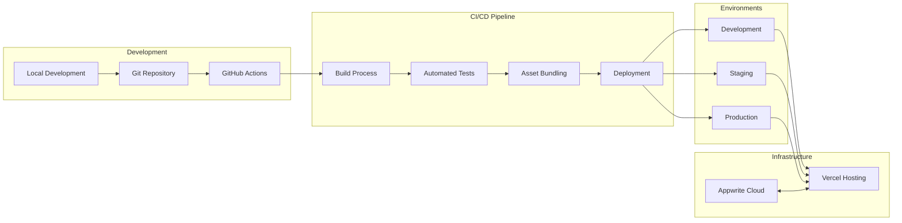

### Build Process

The application build process converts source code into optimized deployable assets:

```
Source Code → TypeScript Compilation → Webpack Bundling → Asset Optimization → Deployment
```

Key components of the build process:

1. **TypeScript Compilation**:
   - Static type checking
   - Transpilation to JavaScript
   - Interface elimination

2. **Vite Bundling**:
   - Code splitting
   - Tree shaking
   - Dynamic imports
   - Module concatenation

3. **Asset Optimization**:
   - CSS minification
   - Image optimization
   - SVG optimization
   - Font subsetting

4. **Bundle Analysis**:
   - Size monitoring
   - Dependency visualization
   - Import cost analysis

### Environment Configuration

CourtMaster uses a multi-environment configuration approach:

```typescript
// Environment configuration types
interface EnvironmentConfig {
  appName: string;
  appwriteEndpoint: string;
  appwriteProjectId: string;
  databaseId: string;
  storageId: string;
  authCookie: string;
  apiKey: string;
  logLevel: LogLevel;
  featureFlags: Record<string, boolean>;
}

// Environment-specific configurations
const environments: Record<string, EnvironmentConfig> = {
  development: {
    appName: 'CourtMaster Dev',
    appwriteEndpoint: 'http://localhost:80/v1',
    // Other development settings
  },
  staging: {
    appName: 'CourtMaster Staging',
    appwriteEndpoint: 'https://appwrite.staging-domain.com/v1',
    // Other staging settings
  },
  production: {
    appName: 'CourtMaster',
    appwriteEndpoint: 'https://appwrite.courtmaster.com/v1',
    // Other production settings
  }
};
```

### Deployment Infrastructure

CourtMaster uses the following cloud services for deployment:

1. **Frontend Hosting**: Vercel
   - Zero-configuration deployments
   - Edge caching
   - Preview deployments for PRs
   - Automatic HTTPS

2. **Backend Services**: Appwrite Cloud
   - Authentication
   - Database
   - Storage
   - Functions
   - Realtime WebSockets

3. **Domain & CDN**: Cloudflare
   - DNS management
   - CDN caching
   - DDoS protection
   - Edge rules

### Deployment Configuration

The deployment configuration is defined in `vercel.json`:

```json
{
  "version": 2,
  "routes": [
    { "handle": "filesystem" },
    { "src": "/assets/(.*)", "headers": { "cache-control": "public, max-age=31536000, immutable" } },
    { "src": "/(.*)", "dest": "/index.html" }
  ],
  "env": {
    "VITE_APP_ENV": "production",
    "VITE_APPWRITE_ENDPOINT": "@appwrite-endpoint",
    "VITE_APPWRITE_PROJECT_ID": "@appwrite-project-id"
  },
  "github": {
    "enabled": true,
    "silent": false
  }
}
```

### Feature Flags

The deployment system includes feature flag support for controlled rollouts:

```typescript
interface FeatureFlags {
  enableNewScoring: boolean;
  enableOfflineSync: boolean;
  enableNewScheduler: boolean;
  enableBetaFeatures: boolean;
}

const featureFlags: Record<Environment, FeatureFlags> = {
  development: {
    enableNewScoring: true,
    enableOfflineSync: true,
    enableNewScheduler: true,
    enableBetaFeatures: true
  },
  staging: {
    enableNewScoring: true,
    enableOfflineSync: true,
    enableNewScheduler: false,
    enableBetaFeatures: true
  },
  production: {
    enableNewScoring: true,
    enableOfflineSync: true,
    enableNewScheduler: false,
    enableBetaFeatures: false
  }
};
```

### Monitoring and Logging

The deployment includes comprehensive monitoring and logging:

1. **Error Tracking**:
   - Client-side error capture
   - Error grouping and classification
   - Error context and breadcrumbs

2. **Performance Monitoring**:
   - Core Web Vitals tracking
   - Custom performance marks
   - User-centric performance metrics

3. **Usage Analytics**:
   - Feature usage tracking
   - User journeys
   - Conversion funnels

## Performance Optimizations

Performance is a critical aspect of the CourtMaster system, especially for tournament-day operations when many users interact with the system simultaneously. The architecture includes multiple performance optimizations across all layers.

### Frontend Performance

#### Code Splitting and Lazy Loading

CourtMaster implements granular code splitting to reduce initial load times:

```typescript
// Route-based code splitting
const TournamentPage = React.lazy(() => import('./pages/TournamentPage'));
const ScoringPage = React.lazy(() => import('./pages/ScoringPage'));

// Component-based code splitting
const BracketVisualizer = React.lazy(() => import('./components/tournament/BracketVisualizer'));

// Routes with lazy loaded components
const AppRoutes = () => (
  <Suspense fallback={<LoadingSpinner />}>
    <Routes>
      <Route path="/tournaments" element={<TournamentPage />} />
      <Route path="/tournaments/:id/scoring" element={<ScoringPage />} />
      {/* Other routes */}
    </Routes>
  </Suspense>
);
```

#### Rendering Optimizations

1. **Component Memoization**:
   ```typescript
   // Memoized component to prevent unnecessary re-renders
   const TeamList = React.memo(({ teams }) => {
     return (
       <ul>
         {teams.map(team => (
           <TeamListItem key={team.id} team={team} />
         ))}
       </ul>
     );
   });
   ```

2. **Virtualized Lists**:
   ```typescript
   // Virtual list for large data sets
   const VirtualizedMatchList = ({ matches }) => {
     return (
       <VirtualList
         height={500}
         itemCount={matches.length}
         itemSize={64}
         width="100%"
         renderItem={({ index, style }) => (
           <div style={style}>
             <MatchListItem match={matches[index]} />
           </div>
         )}
       />
     );
   };
   ```

3. **Throttled Event Handlers**:
   ```typescript
   // Throttled handler for score updates
   const throttledScoreUpdate = useThrottle((score) => {
     updateScore(matchId, score);
   }, 300);
   ```

### Data Access Optimizations

#### Caching Strategy

CourtMaster implements a multi-level caching strategy:

```mermaid
flowchart TD
    Request["Data Request"] --> MemoryCache{"Memory Cache"}
    MemoryCache -->|"Hit"| ReturnData["Return Data"] 
    MemoryCache -->|"Miss"| PersistentCache{"IndexedDB Cache"}
    PersistentCache -->|"Hit"| UpdateMemory["Update Memory Cache"]
    UpdateMemory --> ReturnData
    PersistentCache -->|"Miss"| FetchAPI["Fetch from API"]
    FetchAPI --> UpdateCache["Update All Caches"]
    UpdateCache --> ReturnData
    
    classDef hit fill:#afa,stroke:#6a6,stroke-width:2px;
    classDef miss fill:#faa,stroke:#a66,stroke-width:2px;
    class "Hit" hit;
    class "Miss" miss;
```

#### Efficient Data Loading

1. **Data Prefetching**:
   ```typescript
   // Prefetch tournament data for faster navigation
   const prefetchTournament = (id: string) => {
     tournamentRepository.prefetch(id);
   };
   
   // Prefetch on hover
   <TournamentListItem 
     tournament={tournament}
     onMouseEnter={() => prefetchTournament(tournament.id)}
   />
   ```

2. **Partial Data Fetching**:
   ```typescript
   // Fetch only necessary fields
   const fetchMatchSummary = async (id: string) => {
     return await matchRepository.find(id, {
       fields: ['id', 'teams', 'scores', 'courtId', 'status']
     });
   };
   ```

3. **Background Data Loading**:
   ```typescript
   // Load secondary data in the background after primary content
   useEffect(() => {
     // Primary content loaded
     if (tournament) {
       // Load secondary data in background
       loadTournamentStatistics(tournament.id);
       loadHistoricalMatches(tournament.id);
     }
   }, [tournament]);
   ```

### Offline Performance

#### IndexedDB Optimization

1. **Bulk Operations**:
   ```typescript
   // Bulk insert for better performance
   const bulkInsert = async (entities: Entity[]) => {
     const transaction = db.transaction('entities', 'readwrite');
     const store = transaction.objectStore('entities');
     
     for (const entity of entities) {
       await store.put(entity);
     }
     
     await transaction.complete;
   };
   ```

2. **Indexed Queries**:
   ```typescript
   // Using indexes for efficient queries
   const findByTournament = async (tournamentId: string) => {
     const transaction = db.transaction('matches', 'readonly');
     const store = transaction.objectStore('matches');
     const index = store.index('tournamentId');
     
     return await index.getAll(tournamentId);
   };
   ```

### Bundle Optimization

1. **Tree Shaking**:
   Eliminating unused code through modern bundling techniques

2. **Dependency Optimization**:
   Using lightweight alternatives and importing only required modules

3. **CSS Optimization**:
   Purging unused CSS and inlining critical CSS

4. **Image Optimization**:
   Using responsive images, WebP format, and lazy loading

### Performance Metrics

The system continuously monitors the following performance metrics:

1. **Core Web Vitals**:
   - Largest Contentful Paint (LCP): < 2.5s
   - First Input Delay (FID): < 100ms
   - Cumulative Layout Shift (CLS): < 0.1

2. **Application-Specific Metrics**:
   - Time to Interactive for Tournament View: < 1.5s
   - Score Update Latency: < 300ms
   - Schedule Generation Time: < 5s for 100 matches

## Future Considerations

The CourtMaster architecture is designed to evolve and adapt to changing requirements. This section outlines potential future enhancements and architectural considerations.

### Architectural Enhancements

#### Microservices Evolution

As CourtMaster continues to grow, certain components may benefit from migration to a microservices architecture:

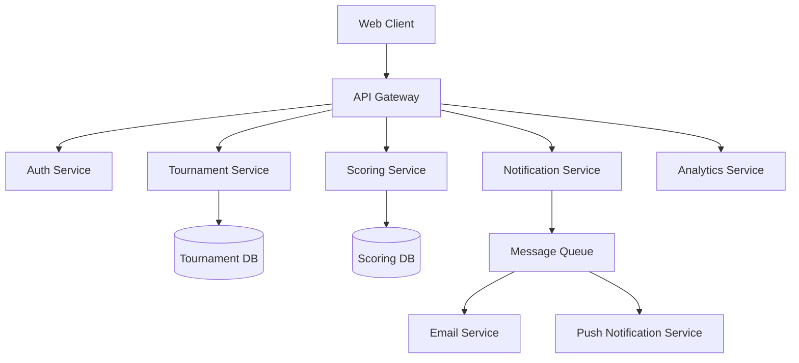

Benefits of this evolution include:
- Independent scaling of high-traffic services
- Isolated deployment of critical components
- Team specialization on specific domains
- Improved fault isolation

#### Serverless Functions Integration

Certain workloads could be migrated to serverless functions for improved scaling and cost efficiency:

1. **Tournament Scheduling**: Running scheduling algorithms on-demand
2. **Report Generation**: Creating PDF reports and statistics
3. **Image Processing**: Optimizing uploaded photos and generating thumbnails
4. **Batch Notifications**: Sending bulk notifications to participants

### Feature Roadmap

The following features are planned for future releases, with architectural implications:

#### Advanced Analytics Platform

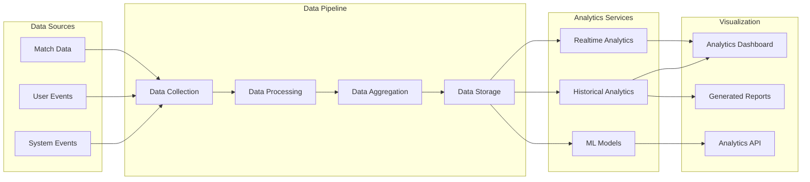

Key architectural considerations:
- Time-series database for performance metrics
- ETL pipeline for data transformation
- Real-time analytics with streaming capabilities
- Data warehouse for historical analysis

#### Mobile Application Support

Future mobile applications will integrate with the existing backend:

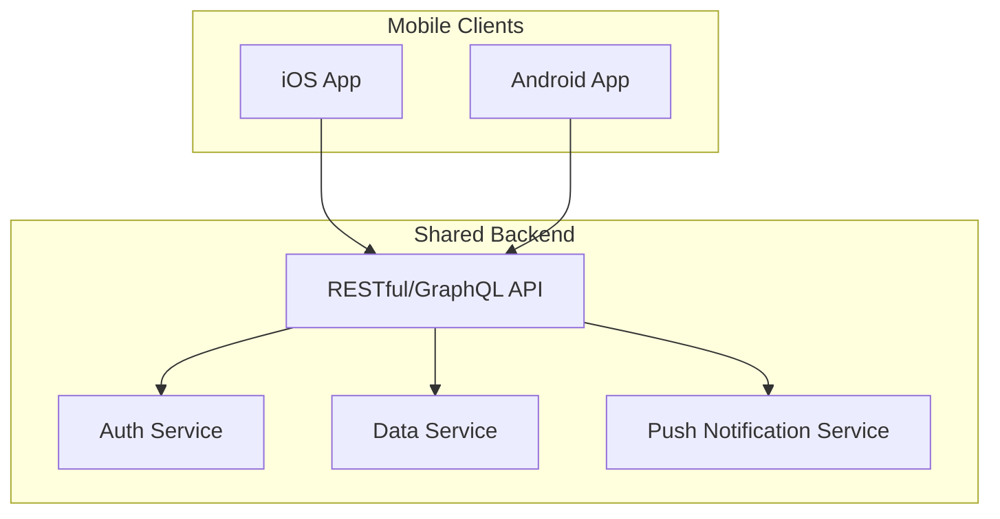

Architectural considerations:
- Mobile-optimized API endpoints
- Responsive data payloads for limited bandwidth
- Offline-first sync strategy shared with web client
- Push notification infrastructure

#### Multi-Tenant Architecture

Future versions may adopt a multi-tenant architecture to support multiple organizations:

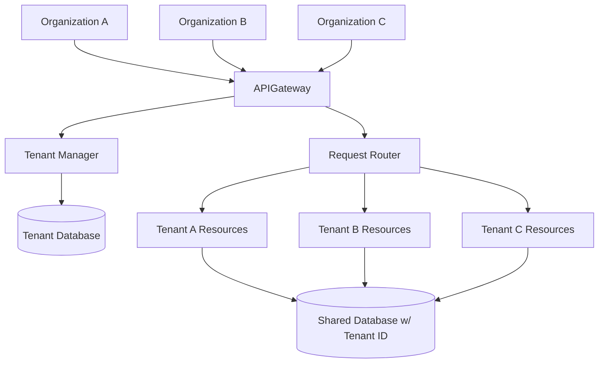

Key considerations:
- Data isolation between tenants
- Tenant-specific configuration
- Shared infrastructure with logical separation
- Custom branding and domain support

### Technical Debt Reduction

Future architecture work should include addressing these areas:

1. **Standardized Error Handling**:
   - Consistent error codes and messages
   - Centralized error monitoring
   - Automatic retry mechanisms

2. **Enhanced Testing Infrastructure**:
   - Expanded unit test coverage
   - Integration test automation
   - Performance test suite
   - E2E test framework

3. **Documentation Improvements**:
   - API documentation with OpenAPI
   - Component interface documentation
   - Architecture decision records

### Technology Evaluation

The following technologies are being evaluated for future integration:

1. **GraphQL API Layer**:
   - Flexible data fetching
   - Reduced network overhead
   - Strongly typed schema

2. **Web Components**:
   - Framework-agnostic UI elements
   - Reusable across projects
   - Encapsulated styling

3. **WebAssembly**:
   - High-performance computation
   - Complex scheduling algorithms
   - Real-time data processing

4. **Real-time Database**:
   - Enhanced real-time capabilities
   - Improved conflict resolution
   - Better offline support

These future considerations will guide the evolution of the CourtMaster architecture to ensure it remains scalable, maintainable, and aligned with user needs.
